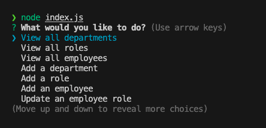

# hw-12-sql-employee-tracker

## Description
  * Use the inquirer package to prompt the user for answers and use postgres to table employee data! 
  * View data including employee name, role, department, and who their manager is!
  * Update the data for any of the rows in the table!
  * Trigger the program with node index.js heres a view of what the terminal will look like after running.

  
  
  ## Table of Contents
  * [Installation](#installation)
  * [Usage](#usage)
  * [Contributing](#contribution)
  * [Questions](#questions)
  * [Obstacles](#obstacles-and-successes)
  
  ## Installation

  To install necessary dependencies, run the following command:

  * npm i
  * connect to the postgres server by running psql -U (username here) and the password for your postgres login. 
  * run the schema and seed the data running \i db/schema.sql and \i db/seeds.sql which creates the tables with starter data. 
  
  ## Usage
  * A Mac or PC with a terminal. Common examples are Zsh for Mac and Bash for Windows.
  * Once you navigate to the correct integrated terminal run the command node index.js to start the prompts. 

  ## Contributing
  * Create a pull request

  ## License
   

This project is unlicensed. 

  
  ## Questions
  * Here is a link to my [GitHub](https://github.com/soko77788) profile.
  * For further questions email me at nicksoko@gmail.com.

  ## Tools and 3rd party assistance
  * Influenced with the week 12 SQL mini-project code along.
  * Screencastify
  * Student AI tool and ChatGPT for creating queries and learning more about joining tables correctly. 

  ## Obstacles and Successes
  * Figuring out how to get the prompts to show up was easy enough but figuring out what to do after they clicked one of the options was a brain buster. Getting the program to run a different query depending on the prompt that was clicked on was extremely hard. I needed AI for that. 
  * Validating queries to prevent SQL injection. Still a bit confusing, but i don't want to leave my future apps vulnerable.
  * Importing information from one js file back to the main index.js file
  * Getting inquirer and postgres working together. Most of class we just connected to postgres using psql -U postgres and using \c to connect to databases but we touched on creating a connection file. Then going about it myself needed some debugging and then i ended up finding a dedicated port for postgres which got the app working. Port 3001 didn't work and in class we weren't even connecting to a server but this project seemed to need it. 
  * After seeing the working product it's hard to envision different ways of solving the homework.
  * Building from scratch is always daunting and using async await doesn't seem to get easier. 

  * Getting the hang of screencastify using it for the 3rd time. 
  * Using inquirer is getting easier. Following the prompt syntax too. 
  * Creating functions for viewing the established tables wasnt bad, but updating the tables was incredibly hard. 
  * Screencastify was already installed so getting the recording down reading the docs was great. 

  ## Video Demo Link

https://drive.google.com/file/d/1vjeNgAjroh0zKyYmEW8mwAPYG4sQ3Wxh/view